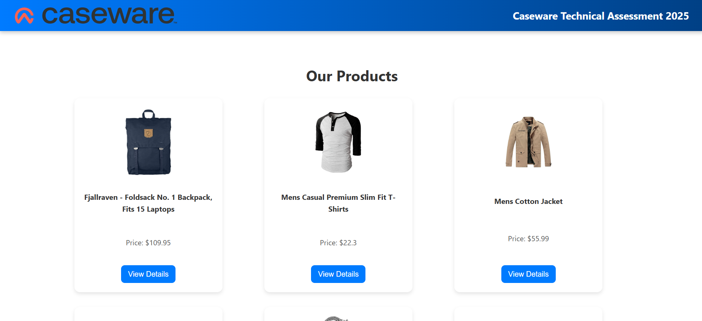
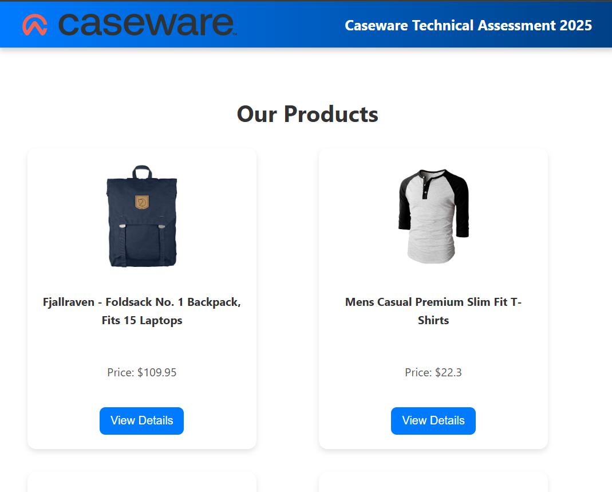
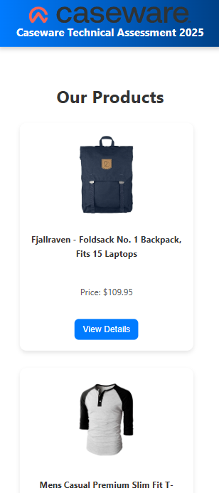
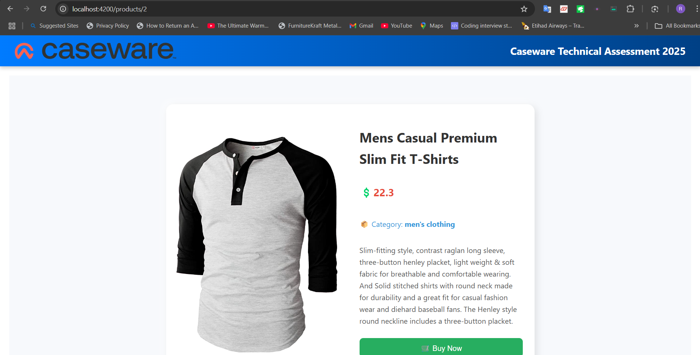
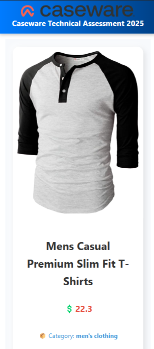
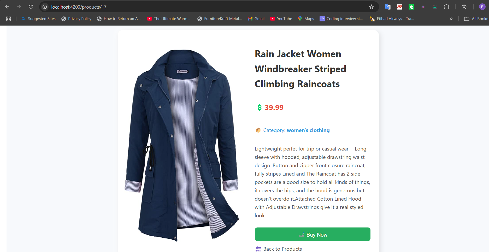
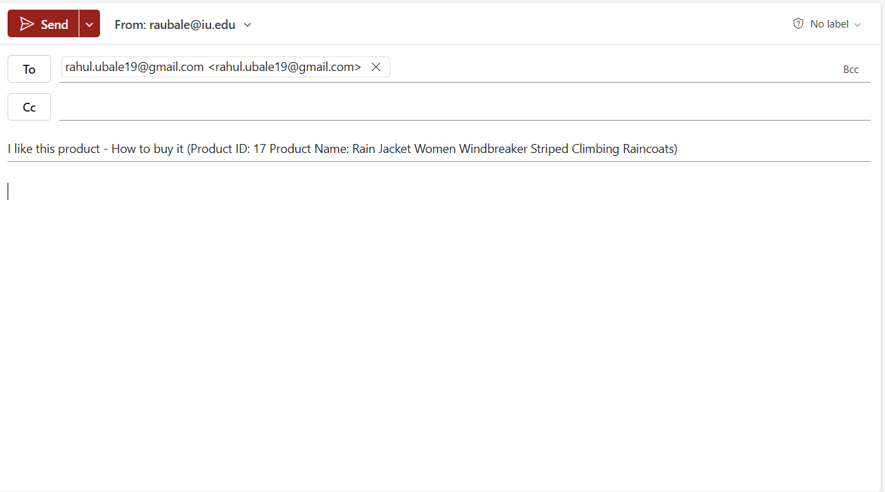

# ProductApp - Angular Assessment

This project was generated using [Angular CLI](https://github.com/angular/angular-cli) version 19.2.3.

## Overview

This Angular application displays a list of products fetched from the [FakeStoreAPI](https://fakestoreapi.com/) ([https://fakestoreapi.com/docs](https://fakestoreapi.com/docs)), allows users to view detailed information about each product, and includes basic navigation between pages. It demonstrates the use of component-based architecture, services, routing, and API integration in Angular.

## Objectives

The goal of this assessment is to evaluate your Angular skills, including:

* Component-based architecture
* Services for data management and API interaction
* Routing for navigation
* Integration with a RESTful API (FakeStoreAPI)
* Use of Observables (RxJS) for asynchronous operations
* Following Angular best practices

## Project Setup (10 points)

1.  **Create a new Angular project:**
    ```bash
    ng new product-app
    cd product-app
    ```

2.  **Set up a clean folder structure:**
    The application structure generally follows the Angular CLI defaults, with key components organized within the `src/app` directory. You will find the following structure (or similar):
    ```
    src/
    ├── app/
    │   ├── components/
    │   │   ├── product-card/
    │   │   │   └── product-card.component.*
    │   │   ├── product-detail/
    │   │   │   └── product-detail.component.*
    │   │   └── product-list/
    │   │       └── product-list.component.*
    │   ├── services/
    │   │   └── product.service.*
    │   ├── app-routing.module.ts
    │   ├── app.component.*
    ├── assets/
    ├── environments/
    ├── screenshots/  <-- Screenshots of the application
    └── ...
    ```

3.  **Initialize a Git repository and make an initial commit:**
    ```bash
    git init
    git add .
    git commit -m "Initial commit - Project setup"
    ```

## Component & Data Binding (30 points)

* **`ProductCardComponent`:** Located in `src/app/components/product-card/`.
    * Displays product details (name, price, description, and potentially an image).
    * Accepts a `product` object via the `@Input()` decorator.
    * Includes a "View Details" button that emits a `viewDetails` event via the `@Output()` decorator when clicked.

* **Usage in `ProductListComponent`:** The `ProductCardComponent` is used within the `ProductListComponent` to display individual product information.

## Service & Data Handling & API Integration (30 points)

* **`ProductService`:** Located in `src/app/services/`.
    * Interacts with the **FakeStoreAPI** ([https://fakestoreapi.com/](https://fakestoreapi.com/)) to fetch product data.
    * Uses the `HttpClient` module to make HTTP requests.
    * Includes methods to:
        * Fetch all products (e.g., `getProducts()`).
        * Fetch a single product by ID (e.g., `getProductById(id: number)`).
    * Utilizes `Observable` from RxJS to handle the asynchronous nature of API calls.

* **`ProductListComponent`:** Located in `src/app/components/product-list/`.
    * Injects the `ProductService`.
    * Calls the `getProducts()` method from the service to retrieve the list of products from the API.
    * Displays the products using the `ProductCardComponent` and iterates through the product list using `*ngFor`.

* **`ProductDetailComponent`:** Located in `src/app/components/product-detail/`.
    * Injects the `ProductService` and `ActivatedRoute`.
    * Retrieves the `id` from the route parameters.
    * Calls the `getProductById()` method of the `ProductService` to fetch the details of the specific product from the API.
    * Displays the detailed information of the selected product.

## Routing & Navigation (30 points)

* **`AppRoutingModule` (or `app.routes.ts`):** Routing configuration is defined in `src/app/app.routes.ts`.
    * The following routes are configured:
        ```typescript
        import { Routes } from '@angular/router';
        import { ProductListComponent } from './components/product-list/product-list.component';
        import { ProductDetailComponent } from './components/product-detail/product-detail.component';

        export const routes: Routes = [
          { path: '', redirectTo: '/products', pathMatch: 'full' },
          { path: 'products', component: ProductListComponent },
          { path: 'products/:id', component: ProductDetailComponent },
        ];
        ```

* **`ProductListComponent`:**
    * When the "View Details" button in a `ProductCardComponent` is clicked, the emitted event is handled.
    * The `ProductListComponent` uses the `Router` service to navigate to the `/products/:id` route, passing the `id` of the selected product.

* **`ProductDetailComponent`:**
    * Injects the `ActivatedRoute` to access the `id` parameter from the URL.
    * Uses the `ProductService` to fetch the details of the product with the given `id` from the API.
    * Displays the detailed information of the selected product.

## Screenshots

The `screenshots` directory in the project root contains images demonstrating the application's user interface and functionality. You can refer to these images to get a visual understanding of the application's different views:

### Product List Page - Desktop View


### Product List Page - Tablet View


### Product List Page - Mobile View


### Product Detail Page - Desktop and Tablet View


### Product Detail Page - Mobile View


### Product Detail Page 


### Product Buy


## Running the Application Locally

Follow these steps to run the Angular application on your local machine:

1.  **Clone the repository:**
    First, you need to clone the project repository to your local machine using Git. Open your terminal or command prompt and navigate to the directory where you want to store the project, then run the following command (replace `<repository_url>` with the actual URL of your Git repository):
    ```bash
    git clone <repository_url>
    cd product-app
    ```
    This will download the project files to a folder named `product-app`.

2.  **Ensure Node.js and npm (or yarn) are installed:**
    You can check if they are installed by running the following commands in your terminal:
    ```bash
    node -v
    npm -v
    # or
    yarn --version
    ```
    If not installed, you can download them from [https://nodejs.org/](https://nodejs.org/).

3.  **Install Angular CLI:**
    If you haven't already, install the Angular CLI globally:
    ```bash
    npm install -g @angular/cli
    # or
    yarn global add @angular/cli
    ```

4.  **Navigate to the project directory:**
    If you haven't already, navigate into the project directory that was created when you cloned the repository:
    ```bash
    cd product-app
    ```

5.  **Install project dependencies:**
    Run the following command to install the necessary npm packages, including `@angular/common/http` (for making API calls):
    ```bash
    npm install
    # or
    yarn install
    ```
    This command reads the `package.json` file and downloads all the dependencies listed there.

6.  **Start the development server:**
    Use the Angular CLI to build and serve the application:
    ```bash
    ng serve -o
    # or
    yarn start
    ```
    The `-o` flag will automatically open the application in your default web browser once it's built and running.

7.  **Access the application:**
    Once the development server is running, you can access the application in your browser at `http://localhost:4200/`.

## Navigation

* Navigating to `http://localhost:4200/products` will display the list of products fetched from the FakeStoreAPI.
* Clicking the "View Details" button for a product will navigate you to `http://localhost:4200/products/1` (or the corresponding ID of the product), displaying the detailed information for that specific product fetched from the FakeStoreAPI.

## Submission

Please share the link to the source code repository (e.g., GitHub) with your assigned technical recruiter.

Thank you for reviewing this assessment!
